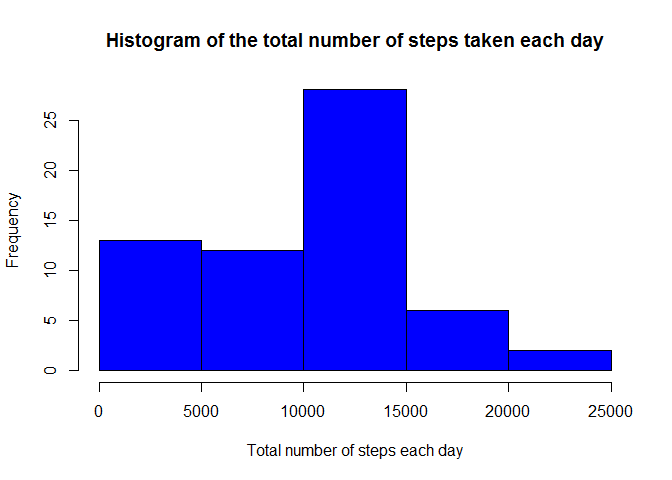
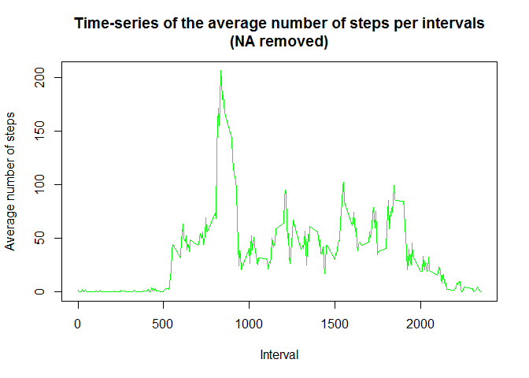
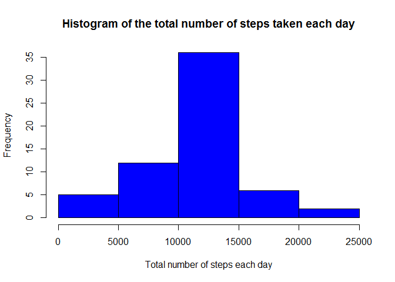
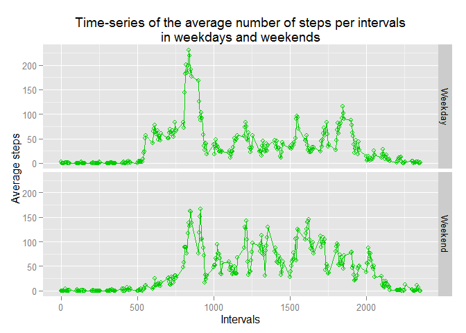

# Reproducible Research: Peer Assessment 1


## Loading and preprocessing the data

1.Loading the data   

```r
if(!file.exists("actMonAnalysis")){
  dir.create("actMonAnalysis")
}

setwd("actMonAnalysis")

if(!file.exists("activityMonitoringData")){
  download.file("https://d396qusza40orc.cloudfront.net/repdata%2Fdata%2Factivity.zip",destfile = "activityMonitoringData")
}

file <- unzip( "activityMonitoringData")
data<-read.csv(file)
```
2.Transforming the date column from character variable type to date type.

```r
data$date<-as.Date(data$date,"%Y-%m-%d")
head(data)
```

```
##   steps       date interval
## 1    NA 2012-10-01        0
## 2    NA 2012-10-01        5
## 3    NA 2012-10-01       10
## 4    NA 2012-10-01       15
## 5    NA 2012-10-01       20
## 6    NA 2012-10-01       25
```
## What is mean total number of steps taken per day?

The missing values are ignored in this part.

1.Calculate the total number of steps taken per day  

```r
aggdata <-setNames( aggregate(data$steps, by=list(data$date), FUN=sum, na.rm=TRUE) ,c("dates","steps"))
```
2.Creating a histogram of the total number of steps taken each day. 

```r
hist(aggdata$steps, main ="Histogram of the total number of steps taken each day",xlab = "Total number of steps each day",col="blue")
```

<!-- -->

```r
stepsMean<-mean(aggdata$steps)
stepsMedian<-median(aggdata$steps)
```
3.Calculate and report the mean and median of the total number of steps taken per day.  

The mean of total number of steps is 9354.2295082.
The median of total number of steps is 10395.

## What is the average daily activity pattern?
1.Make a time series plot (i.e. type = "l") of the 5-minute interval (x-axis) and the average number of steps taken, averaged across all days (y-axis)  

```r
aggdata2 <-setNames( aggregate(data$steps, by=list(data$interval), FUN="mean", na.rm=TRUE) ,c("intervals","Avgsteps"))
plot(aggdata2$intervals, aggdata2$Avgsteps,
     type="l",col="green", 
     xlab="Interval", 
     ylab="Average number of steps", 
     main="Time-series of the average number of steps per intervals\n(NA removed)")
```

<!-- -->

```r
maxStepsInterval<-aggdata2[which(aggdata2$Avgsteps==max(aggdata2$Avgsteps)),1]
```
2.Which 5-minute interval, on average across all the days in the dataset, contains the maximum number of steps?  
The 835 th five minute interval contains the maximum average across all the days in the data set.  

## Imputing missing values
1.Calculate and report the total number of missing values in the dataset.

```r
totalnumMissValue<-sum(is.na(data$steps))
```
There are 2304 missing values in the data set.  

2.Devise a strategy for filling in all of the missing values in the dataset. 
The strategy used is imputing the mean for that 5-minute interval over days.    

3.Create a new dataset that is equal to the original dataset but with the missing data filled in.  


```r
ImputedData<-data
for(i in 1:nrow(data)){
  if(is.na(data$steps[i])){
    temp<-mean(data[which(data$interval==data$interval[i] & !is.na(data$steps)),1])
    ImputedData$steps[i]<-temp
  }
}
head(ImputedData)
```

```
##       steps       date interval
## 1 1.7169811 2012-10-01        0
## 2 0.3396226 2012-10-01        5
## 3 0.1320755 2012-10-01       10
## 4 0.1509434 2012-10-01       15
## 5 0.0754717 2012-10-01       20
## 6 2.0943396 2012-10-01       25
```
4.Make a histogram of the total number of steps taken each day and Calculate and report the mean and median total number of steps taken per day. Do these values differ from the estimates from the first part of the assignment? What is the impact of imputing missing data on the estimates of the total daily number of steps?

```r
aggdata3 <-setNames( aggregate(ImputedData$steps, by=list(ImputedData$date), FUN=sum, na.rm=TRUE) ,c("dates","steps"))
hist(aggdata3$steps, main ="Histogram of the total number of steps taken each day",xlab = "Total number of steps each day",col="blue")
```

<!-- -->

```r
imputedStepsMean<-mean(aggdata3$steps)
imputedStepsMedian<-median(aggdata3$steps)
```
The mean of total number of steps is 1.0766189\times 10^{4}.  
The median of total number of steps is 1.0766189\times 10^{4}.

As it is shown there is a big difference between the values after imputation and before.These larger values are result of having more data intead on NA s.  

## Are there differences in activity patterns between weekdays and weekends?  
1.Create a new factor variable in the dataset with two levels - "weekday" and "weekend" indicating whether a given date is a weekday or weekend day.  

```r
ImputedData$dayType<-factor(ifelse((weekdays(data$date)=="Saturday"| weekdays(data$date)=="Sunday"),"Weekend","Weekday"))
head(ImputedData)
```

```
##       steps       date interval dayType
## 1 1.7169811 2012-10-01        0 Weekday
## 2 0.3396226 2012-10-01        5 Weekday
## 3 0.1320755 2012-10-01       10 Weekday
## 4 0.1509434 2012-10-01       15 Weekday
## 5 0.0754717 2012-10-01       20 Weekday
## 6 2.0943396 2012-10-01       25 Weekday
```
2.Make a panel plot containing a time series plot (i.e. type = "l") of the 5-minute interval (x-axis) and the average number of steps taken, averaged across all weekday days or weekend days (y-axis). See the README file in the GitHub repository to see an example of what this plot should look like using simulated data.

```r
library(ggplot2) 
```

```r
aggData4 <- setNames(aggregate(ImputedData$steps,by=list(ImputedData$interval,ImputedData$dayType),FUN="mean"),c("intervals","dayType","stepsMean"))
plot <- ggplot(aggData4, aes(x=aggData4$intervals, y=aggData4$stepsMean)) + geom_point(shape=1,colour=3)+geom_line(colour=3)+labs(x="Intervals",y=" Average steps")+ggtitle("Time-series of the average number of steps per intervals\nin weekdays and weekends")
plot + facet_grid(dayType ~ .)
```

<!-- -->
